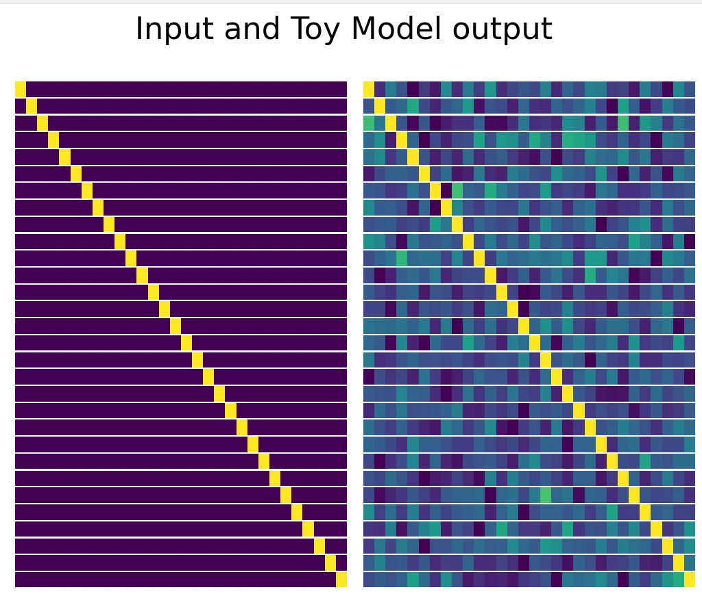
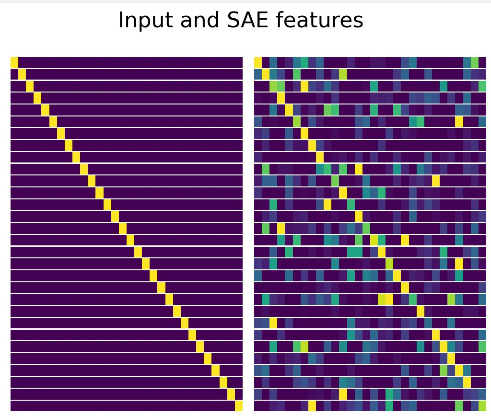
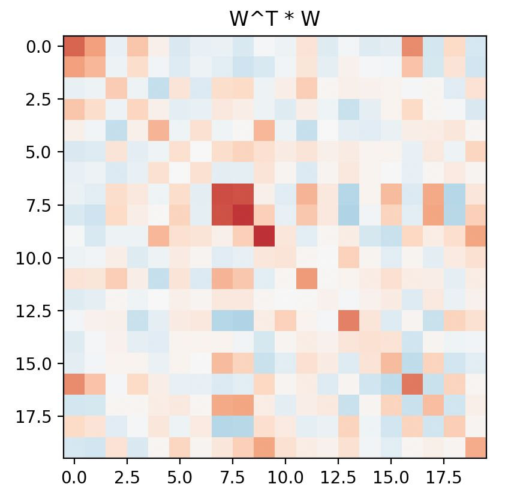

# Automated Feature Discovery for AI Safety - The Circuit Breakers

## Overview
This repository contains the work of Team Circuit Breakers for the AI Safety Hackathon hosted at TU Delft. Our project aims to advance the field of AI safety by developing a novel method for automated feature discovery using sparse autoencoders.

## Table of Contents
- [Project Description](#project-description)
- [Event Information](#event-information)
- [Installation](#installation)
- [Usage](#usage)
- [Contributing](#contributing)
- [Resources](#resources)
- [Team](#team)
- [Acknowledgements](#acknowledgements)
- [License](#license)

## Project Description
Whereas automated circuit discovery for mechanistic interpretability has been used to examine behaviors on a neuron level, our proposal introduces a novel method that automatically discovers features instead of circuits. Leveraging the latest breakthrough in mechanistic interpretability, our project utilizes sparse autoencoders for efficient training, data efficiency, automated interpretability metrics, task-specific feature identification, fine-grained behavioral control, and adversarial feature testing. For more details on the project's goals, please refer to our [Notion Goals Page](INSERT_LINK_HERE).

## Event Information
For detailed event information, please visit the [Hackathon Event Page](https://lu.ma/ua7pzcop).

## Installation
Instructions on how to install and set up the project.

```bash
git clone https://github.com/thijmennijdam/ai_safety_hackathon
cd ai_safety_hackathon
# Follow further instructions for environment setup and dependencies installation
```

## Usage
A step-by-step guide on how to use the software, including code snippets and screenshots for clarity.

## Images







## Contributing
Guidelines for how others can contribute to the project. Include instructions for submitting pull requests, coding standards, and how to run tests.

## Resources
Links to resources used in the project, including papers, articles, and tools:

Toy Models of Superposition
Towards Monosemanticity
Sparse Autoencoders in Language Models
Automatic Circuit Discovery for Mechanistic Interpretability
Interpretability in the Wild

## Team
Information about the team members and their roles.

## Acknowledgements
Acknowledgements for any support received during the hackathon, including API credits, computing resources, and any individuals or organizations that provided assistance.

## License
MIT
